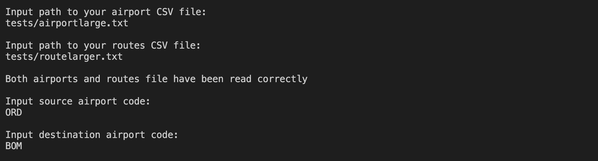
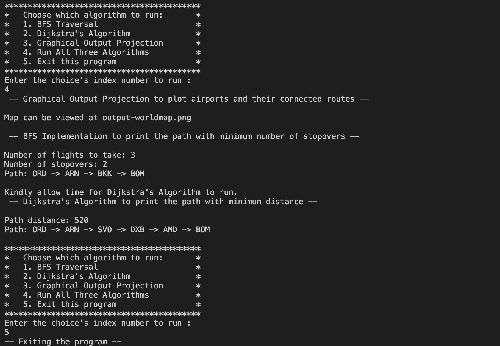
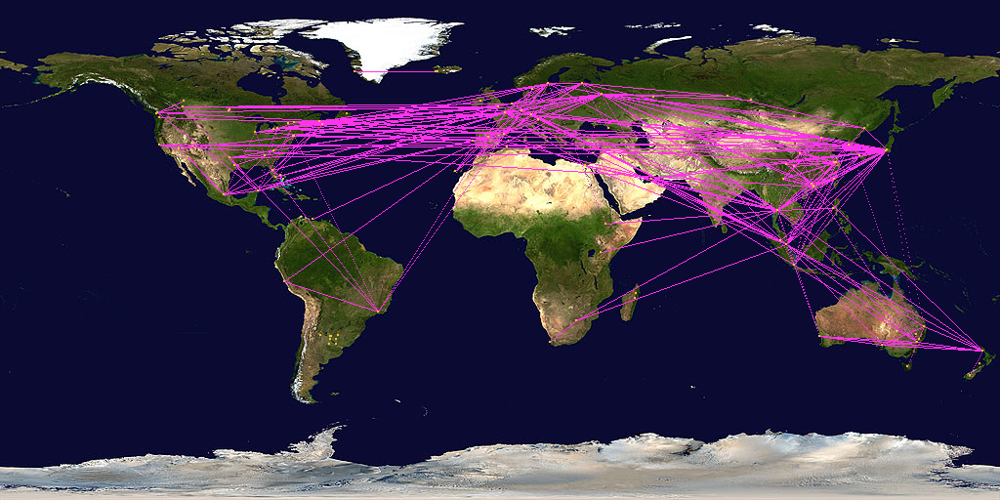

# ckaewla2-sv23-aisheem2-pingali4
# CS225 Final Project

## Team Members: Aishee Mondal, Sanjana Pingali, Jeep Kaewla, Sreenidhi Vijayaraghavan ##

## Presentation Video ##
Link to our recorded presentation video: https://www.youtube.com/watch?v=app6GvAOswA

## Documentation ##
***Our Dataset***

We used the OpenFlights database found at (https://openflights.org/data.html) which was provided as one of the example datasets for our project. The files were originally airports.dat and routes.dat which we converted to csv (txt) files. We extracted the data that we needed from the airports.txt and routes.txt files to obtain the airports and routes respectively to create a graph of vertices that are airports and edges that are routes. 

***Our Project***

The data set was used to create optimized flight paths based on different factors: stopovers, distances. To optimize the number of stopovers between the source and destination airport, we used BFS, and to optimize the distances between the two airports by using Dijkstra’s Algorithm. We also used the data to create a graphical output projection to visualize the actual connections between airports on the map, with the vertices being the airport and the edges being the route.

***File format***

To obtain the source and destination airports from the airports and routes text (txt) files. 
The airport file has the format Airport ID, Name, City, Country, IATA, ICAO, Latitude. Longitude, Altitude, Timezone, DST, Tz database timezone, Type and Source. This is used to extract IATA/ICAO codes, the latitudes and the longitudes. The routes are in the format Airline, Airline ID, Source airport, Source airport ID, Destination airport, Destination airport ID, Codeshare, Stops and Equipment. This is used to extract the route using the destination and source airport.

***Dependencies***

clang++

***Instructions to build and run***

First, you can download/clone our repository at:  https://github-dev.cs.illinois.edu/cs225-fa20/ckaewla2-sv23-aisheem2-pingali4.git

We have two executable files in our project which are called “project” and “test.” The “project” executable is the executable with our main program, which can be called to input our desired source files and it will create the graph of the dataset passed in. 


To make and run our project executable:
```
make
```
The following command can be used to run the project executable:
```
./project
```
2) Enter the path file to airport CSV and the path to routes CSV into the terminal

Ex: data/airports.txt if airports.txt is in the data folder in your directory

3) Enter the input source airport and destination nodes.  Make sure the two inputs are in your dataset otherwise no flight path can be calculated.

4) The executable will run and give the user a choice menu where they can choose the algorithms they wish to run on the inputted dataset. BFS will output the path with the least number of stopovers to the terminal and Dijkstra's Algorithm will do the same but for the path with the shortest distance. Please kindly allow some time for Dijkstra’s algorithm to run if testing on a very large dataset.


The test executable is the executable with all of our 15 test cases. 

1) To make and run our project test executable type:
```
make test
```
2) The following command can be used to run the test executable:
```
./test
```
Alternatively, you can run tests on a specific algorithm by using the following commands:
```
./test "[part=filereading]"       //To run the csv file format check
./test “[part=graphcreation]”     //To run the graphical output projection test cases
./test “[part=BFS]”               //To run BFS test cases
./test “[part=DIJ]”               //To run the Dijkstra’s Algorithm test cases
```
3) The executable then will run our test cases. 

***Output format***

We have two types of output: one is a display in the terminal and the other saves as a PNG file.

The user is prompted to input the path to their datafile as well as the airport codes of their chosen source and destination as shown below:


The display in the terminal then allows the user to select the option (1 - 5) of the algorithm that they wish to run. Once the chosen algorithm finishes running and outputs to the terminal, the user is reprompted for a choice in a loop until they choose to exit the program by entering (5). 


  
***PNG graphical projection***

The output is a graph that is written to a png file. When ‘make’ is run the output is stored in ‘output-worldmap.png’ When ‘make test’ is run then the output test pngs are created. It is ‘output_small.png’ for the small test case, ‘output_medium.png’ for a medium test case and ‘output_large.png’ for a large test case. This graph appears on the original image showing the vertices as airports that are yellow and edges are routes that are pink. 

For example, this is the outputted image when we test on 'airportlarge.txt' and 'routelarger.txt' (a subset of airport.txt and routes.txt that we created for testing purposes):


***Dijkstra’s Algorithm and BFS***

For BFS, the path with the least number of stopovers and the number of flights between the source and destination node are printed in the terminal. We also print out the path from the source to the destination including all stopover airports in the terminal.
For Dijkstra’s algorithm, the path with the least distance is printed out from source to destination. We also print out the total distance between the input source and destination by adding up the edge weights of the respective edges travelled.

 
Note: Most of the commits are made by sv23, since we all chose to code together in real time on one person's terminal while screensharing on zoom.
